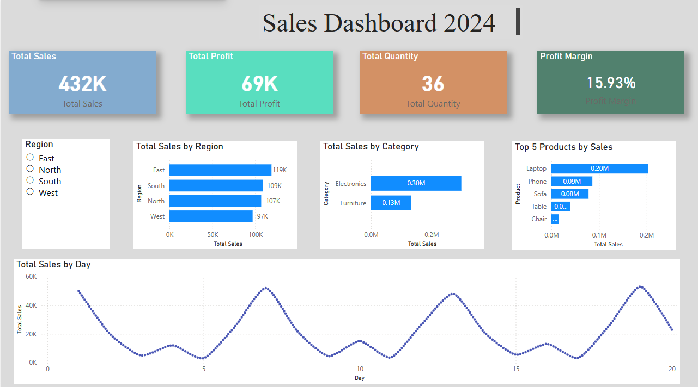

# 📊 Sales Dashboard (Power BI)

## 🔍 Overview
This project presents an interactive sales dashboard built using Power BI to analyze business performance across different regions, categories, and time periods.

The dashboard provides clear insights into sales trends, profitability, and product performance, helping in better decision-making.

## 🛠️ Tools & Technologies
- Microsoft Power BI
- Microsoft Excel

## 📈 Key Features
- KPI Cards for Total Sales, Profit, and Quantity
- Sales by Region (Bar Chart)
- Category-wise Sales Distribution (Pie Chart)
- Sales Trend Over Time (Line Chart)
- Interactive Slicer for Region filtering

## 📊 Dashboard Insights
- Identifies high-performing regions
- Highlights top-selling product categories
- Tracks sales trends over time
- Enables quick filtering for dynamic analysis

## 🧠 What I Learned
- Data visualization best practices
- Creating interactive dashboards
- Using Power BI visuals effectively
- Structuring dashboards for business insights

## 📷 Dashboard Preview

## 📁 Files Included
- `sales-dashboard.pbix` – Power BI dashboard file
- `dashboard.png` – Dashboard preview image
- `sales_data.xlsx` – Dataset used for building the dashboard

## 🚀 Conclusion
This project demonstrates how raw data can be transformed into meaningful insights using Power BI, helping businesses make data-driven decisions.
